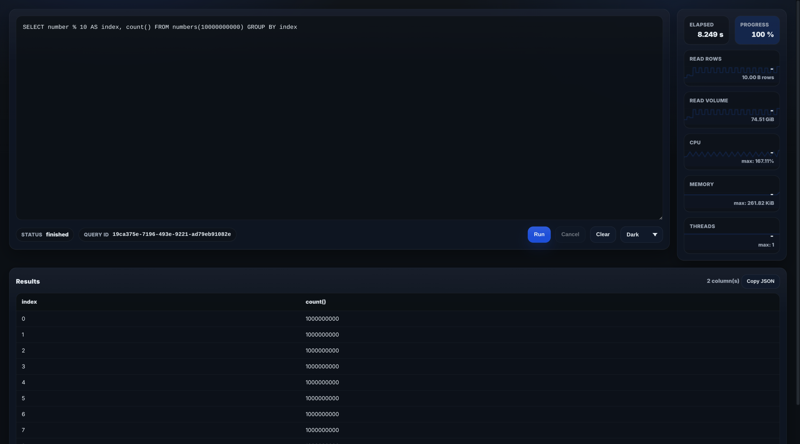

# ClickHouse Dash

A real-time ClickHouse query dashboard with live metrics, high-frequency sampling, and zero-dependency frontend.

<p align="center">
  
</p>

---

## ✨ Features

* 🔎 Execute any ClickHouse SQL query
* 📊 Real-time metrics streaming via SSE
* ⚡ 10ms internal sampling resolution
* 📡 4 SSE updates per second
* 📈 Smooth background sparkline charts
* 📦 Single lightweight binary (Go)
* 🎨 Modern dark/light UI (Inter font)
* 🧠 Automatic rate derivation (rows/sec & bytes/sec)
* 🛑 Query cancellation (including `KILL QUERY`)
* 🔐 SQL guard support

---

## 🏗 Architecture

Backend: **Go + clickhouse-go v2**
Frontend: **Vanilla JS + Canvas**
Transport: **Server-Sent Events (SSE)**

```
Browser
   │
   │  /api/query
   │  /api/query/stream (SSE)
   ▼
Go HTTP Server
   │
   ▼
ClickHouse
```

---

## 📊 Metrics Model

Each `tick` SSE event contains:

```
[
  t_ms,
  percent, percent_known,
  read_rows, read_bytes, total_rows,
  rows_per_sec, bytes_per_sec,
  cpu_bp, cpu_max_bp,
  mem_inst, mem_max,
  threads_inst, threads_max,
  samples[]
]
```

Where:

* `samples[]` = 10ms resolution samples between two ticks
* Charts use:

  * **Rows chart → rows/sec**
  * **Volume chart → bytes/sec**
  * CPU → %
  * Memory → bytes
  * Threads → count

No dictionaries are used — only arrays of integers.

---

## 🚀 Quick Start

### 1️⃣ Using Docker (recommended)

```
cd test
docker-compose up
```

Dashboard available at:

```
http://localhost:8080
```

---

### 2️⃣ Local build

```
cd src
go build -o clickhouse-dash
./clickhouse-dash
```

---

## ⚙️ Configuration

Environment variables:

| Variable                      | Default        | Description        |
| ----------------------------- | -------------- | ------------------ |
| LISTEN_HOST                   | 127.0.0.1      | HTTP host          |
| LISTEN_PORT                   | 8080           | HTTP port          |
| CH_URL                        | 127.0.0.1:9000 | ClickHouse address |
| CH_USER                       | default        | DB user            |
| CH_PASS                       |                | DB password        |
| CH_DATABASE                   | default        | Database           |
| DEFAULT_MAX_EXECUTION_SECONDS | 60             | Query timeout      |
| DEFAULT_MAX_RESULT_ROWS       | 10000          | Row limit          |
| DEFAULT_MAX_RESULT_BYTES      | 10485760       | Byte limit         |

---

## 🧠 Query Execution Model

* Query starts when SSE stream attaches
* ClickHouse callbacks feed internal metrics
* Telemetry sampling occurs every 10ms
* SSE emits unified `tick` event every 250ms
* Final `done` event closes stream

---

## 📂 Project Structure

```
.github/
  .ressources/        → screenshots
  workflows/          → GitHub release pipeline

src/
  server.go           → HTTP + SSE
  query_session.go    → query lifecycle
  metrics_calculation.go
  clickhouse_connection_manager.go
  static/
    index.html
    app.js
    style.css

test/
  docker-compose.yml
  Dockerfile
```

---

## 🧪 Tests

```
go test ./...
```

Includes:

* SQL guard tests
* Metrics calculation tests
* Log parsing tests

---

## 📦 Release

Automated via:

```
.github/workflows/release.yaml
```

Uses `goreleaser`.

---

## 🎨 UI Notes

* Inter variable font
* Sparkline charts rendered via Canvas
* Number formatting stabilized (no layout jitter)
* Full history retained (downsampled only at render time)

---

## 🛡 SQL Guard

`sql_guard.go` prevents unsafe patterns depending on configuration.

---

## 📈 Performance

* ~10ms internal resolution
* 4 network pushes per second
* Decimation at render level
* Memory capped per series

---

## 🔧 Future Improvements

* Query history
* Query profiling breakdown
* Multi-node cluster metrics
* Slow query log overlay
* Export CSV
* Authentication layer

---

## 📝 License

MIT
